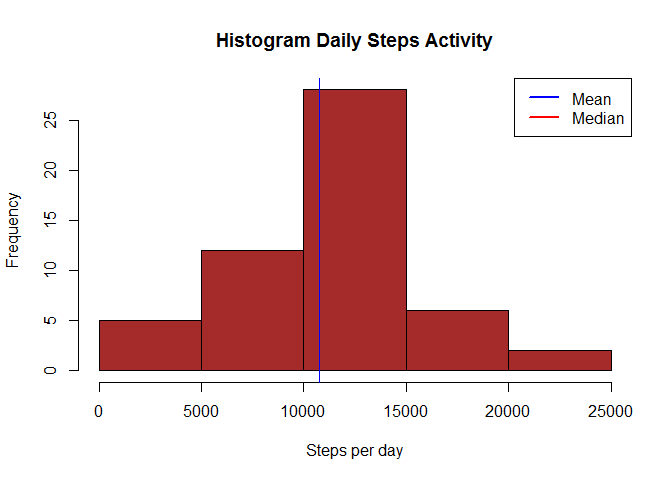
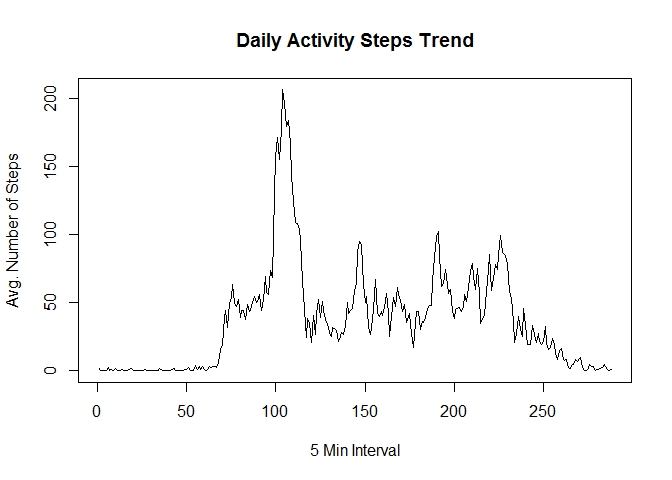
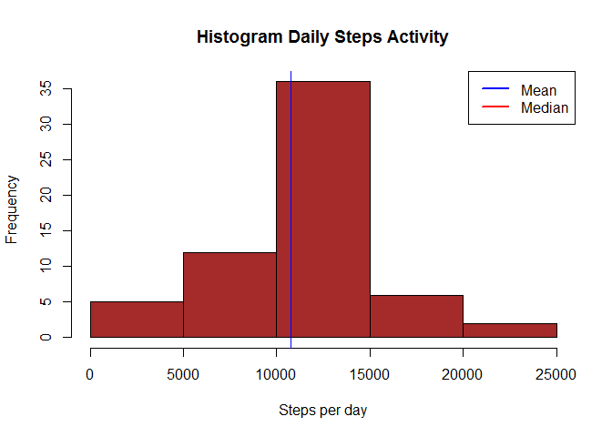
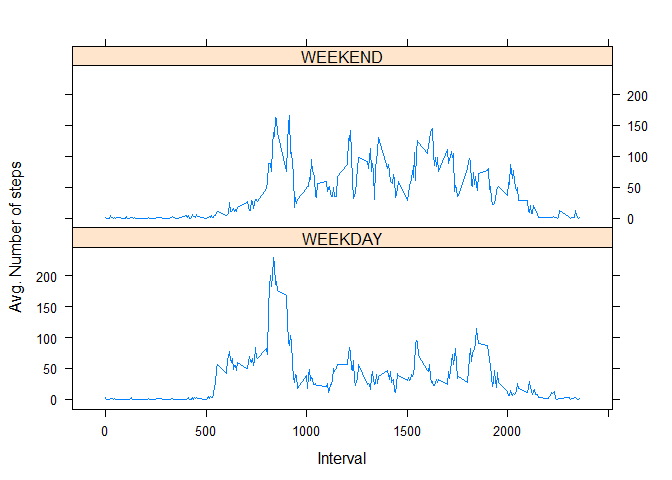

## Load Libraries

```
## Warning: package 'dplyr' was built under R version 3.4.3
```

```
## 
## Attaching package: 'dplyr'
```

```
## The following objects are masked from 'package:stats':
## 
##     filter, lag
```

```
## The following objects are masked from 'package:base':
## 
##     intersect, setdiff, setequal, union
```

```
## Warning: package 'ggplot2' was built under R version 3.4.3
```

## Loading and preprocessing the data

```r
#setwd("~/Reproducible Research") #Set working dir

unzip("activity.zip")
activity_data <- read.table(file= "activity.csv", header=TRUE,
                            sep=",",quote="\"")
activity_data$date <- as.Date(activity_data$date)

summary(activity_data)
```

```
##      steps             date               interval     
##  Min.   :  0.00   Min.   :2012-10-01   Min.   :   0.0  
##  1st Qu.:  0.00   1st Qu.:2012-10-16   1st Qu.: 588.8  
##  Median :  0.00   Median :2012-10-31   Median :1177.5  
##  Mean   : 37.38   Mean   :2012-10-31   Mean   :1177.5  
##  3rd Qu.: 12.00   3rd Qu.:2012-11-15   3rd Qu.:1766.2  
##  Max.   :806.00   Max.   :2012-11-30   Max.   :2355.0  
##  NA's   :2304
```

```r
head(activity_data)
```

```
##   steps       date interval
## 1    NA 2012-10-01        0
## 2    NA 2012-10-01        5
## 3    NA 2012-10-01       10
## 4    NA 2012-10-01       15
## 5    NA 2012-10-01       20
## 6    NA 2012-10-01       25
```


## What is mean total number of steps taken per day?

```r
StepsDayTotal <- aggregate(steps ~ date, data = activity_data, sum, na.rm = TRUE)
head(StepsDayTotal)
```

```
##         date steps
## 1 2012-10-02   126
## 2 2012-10-03 11352
## 3 2012-10-04 12116
## 4 2012-10-05 13294
## 5 2012-10-06 15420
## 6 2012-10-07 11015
```

```r
summary(StepsDayTotal)
```

```
##       date                steps      
##  Min.   :2012-10-02   Min.   :   41  
##  1st Qu.:2012-10-16   1st Qu.: 8841  
##  Median :2012-10-29   Median :10765  
##  Mean   :2012-10-30   Mean   :10766  
##  3rd Qu.:2012-11-16   3rd Qu.:13294  
##  Max.   :2012-11-29   Max.   :21194
```

```r
hist(StepsDayTotal$steps,col="brown", binwidth = 1500,
 xlab = "Steps per day",
 main = "Histogram Daily Steps Activity")
```

```
## Warning in plot.window(xlim, ylim, "", ...): "binwidth" is not a graphical
## parameter
```

```
## Warning in title(main = main, sub = sub, xlab = xlab, ylab = ylab, ...):
## "binwidth" is not a graphical parameter
```

```
## Warning in axis(1, ...): "binwidth" is not a graphical parameter
```

```
## Warning in axis(2, ...): "binwidth" is not a graphical parameter
```

```r
abline(v = median(StepsDayTotal$steps, na.rm=TRUE), col = "red", lwd = 0.5)
abline(v =   mean(StepsDayTotal$steps, na.rm=TRUE), col = "blue", lwd = 0.5)

legend(x = "topright", # location of legend within plot area
 c("Mean", "Median"), col = c("blue", "red"), lwd = c(2, 2))
```

<!-- -->


```r
# Mean of Total Steps per day:
mean(StepsDayTotal$steps, na.rm=TRUE)
```

```
## [1] 10766.19
```

```r
# Median of Total Steps per day:
median(StepsDayTotal$steps, na.rm=TRUE)
```

```
## [1] 10765
```


## What is the average daily activity pattern?

```r
ts_Act <- tapply(activity_data$steps, activity_data$interval, mean, na.rm = TRUE)

plot(ts_Act, type="l", 
     xlab="5 Min Interval", 
     ylab="Avg. Number of Steps", 
     main="Daily Activity Steps Trend", col=1 )
```

<!-- -->

```r
# Interval with Max Average steps
max_I <- ts_Act[which.max(ts_Act)]
print(max_I)
```

```
##      835 
## 206.1698
```


## Imputing missing values

####Calculate and report the total number of missing values in the dataset


```r
#Calculate and report the total number of missing values in the dataset
#tot_missing <- sum(is.na(activity_data))
#tot_missing

actDataMiss <- is.na(activity_data$steps)
sum(actDataMiss)
```

```
## [1] 2304
```

```r
#Devise a strategy for filling in all of the missing values in the dataset. The
#strategy does not need to be sophisticated. For example, you could use
#the mean/median for that day, or the mean for that 5-minute interval, etc.

Impute_mean <- function(num) 
                     replace(num, is.na(num), mean(num, na.rm = TRUE))

##Create a new dataset that is equal to the original dataset but with the
##missing data filled in.

newData <- ( activity_data %>% 
                group_by(interval) %>% 
                    mutate(steps = round(Impute_mean(steps))))
```

```
## Warning: package 'bindrcpp' was built under R version 3.4.3
```

```r
head(newData,20)
```

```
## # A tibble: 20 x 3
## # Groups:   interval [20]
##    steps       date interval
##    <dbl>     <date>    <int>
##  1     2 2012-10-01        0
##  2     0 2012-10-01        5
##  3     0 2012-10-01       10
##  4     0 2012-10-01       15
##  5     0 2012-10-01       20
##  6     2 2012-10-01       25
##  7     1 2012-10-01       30
##  8     1 2012-10-01       35
##  9     0 2012-10-01       40
## 10     1 2012-10-01       45
## 11     0 2012-10-01       50
## 12     0 2012-10-01       55
## 13     0 2012-10-01      100
## 14     1 2012-10-01      105
## 15     0 2012-10-01      110
## 16     0 2012-10-01      115
## 17     0 2012-10-01      120
## 18     1 2012-10-01      125
## 19     2 2012-10-01      130
## 20     0 2012-10-01      135
```

```r
summary(newData)
```

```
##      steps             date               interval     
##  Min.   :  0.00   Min.   :2012-10-01   Min.   :   0.0  
##  1st Qu.:  0.00   1st Qu.:2012-10-16   1st Qu.: 588.8  
##  Median :  0.00   Median :2012-10-31   Median :1177.5  
##  Mean   : 37.38   Mean   :2012-10-31   Mean   :1177.5  
##  3rd Qu.: 27.00   3rd Qu.:2012-11-15   3rd Qu.:1766.2  
##  Max.   :806.00   Max.   :2012-11-30   Max.   :2355.0
```


```r
StepsDayTotal <- aggregate(steps ~ date, data = newData, sum, na.rm = TRUE)
head(StepsDayTotal)
```

```
##         date steps
## 1 2012-10-01 10762
## 2 2012-10-02   126
## 3 2012-10-03 11352
## 4 2012-10-04 12116
## 5 2012-10-05 13294
## 6 2012-10-06 15420
```

```r
hist(StepsDayTotal$steps,col="brown",
 xlab = "Steps per day",
 main = "Histogram Daily Steps Activity")
abline(v = median(StepsDayTotal$steps, na.rm=TRUE), col = "red", lwd = 0.5)
abline(v =   mean(StepsDayTotal$steps, na.rm=TRUE), col = "blue", lwd = 0.5)

legend(x = "topright", # location of legend within plot area
 c("Mean", "Median"), col = c("blue", "red"), lwd = c(2, 2))
```

<!-- -->

```r
# Mean of Total Steps per day:
mean(StepsDayTotal$steps, na.rm=TRUE)
```

```
## [1] 10765.64
```

```r
# Median of Total Steps per day:
median(StepsDayTotal$steps, na.rm=TRUE)
```

```
## [1] 10762
```


## Are there differences in activity patterns between weekdays and weekends?

```r
newData$isWday <-
!(weekdays(as.Date(newData$date)) %in% c('Saturday','Sunday'))

newData$wday <- c('')
newData$wday[which(newData$isWday)] <- c('WEEKDAY')
newData$wday[which(newData$isWday=='FALSE')] <- c('WEEKEND')
table(newData$wday)
```

```
## 
## WEEKDAY WEEKEND 
##   12960    4608
```

```r
head(newData)
```

```
## # A tibble: 6 x 5
## # Groups:   interval [6]
##   steps       date interval isWday    wday
##   <dbl>     <date>    <int>  <lgl>   <chr>
## 1     2 2012-10-01        0   TRUE WEEKDAY
## 2     0 2012-10-01        5   TRUE WEEKDAY
## 3     0 2012-10-01       10   TRUE WEEKDAY
## 4     0 2012-10-01       15   TRUE WEEKDAY
## 5     0 2012-10-01       20   TRUE WEEKDAY
## 6     2 2012-10-01       25   TRUE WEEKDAY
```

```r
PSteps <- aggregate(newData$steps, list(as.numeric(newData$interval),newData$wday),FUN="mean")


names(PSteps) <- c("interval","wday", "avgSteps")
head(PSteps)
```

```
##   interval    wday   avgSteps
## 1        0 WEEKDAY 2.28888889
## 2        5 WEEKDAY 0.40000000
## 3       10 WEEKDAY 0.15555556
## 4       15 WEEKDAY 0.17777778
## 5       20 WEEKDAY 0.08888889
## 6       25 WEEKDAY 1.57777778
```

```r
xyplot(PSteps$avgSteps ~ PSteps$interval | PSteps$wday, 
       layout = c(1, 2), type = "l", 
       xlab = "Interval", ylab = "Avg. Number of steps")
```

<!-- -->

